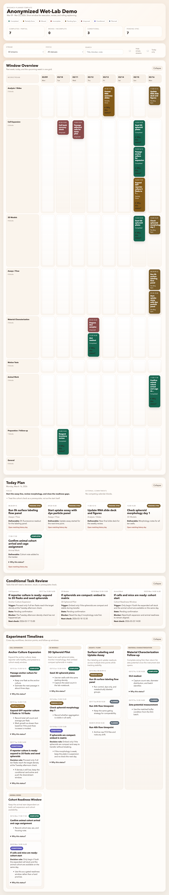
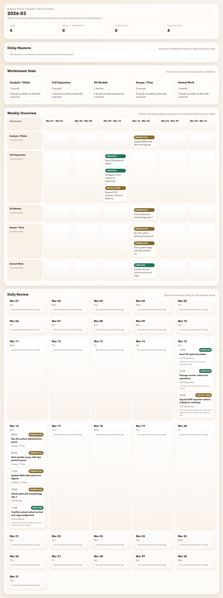

# Research Planner Template

English | [简体中文](./README.zh-CN.md)

Research Planner Template is a local-first planning system for wet-lab and experiment-heavy research work. It combines a short-window execution dashboard, fixed-format daily reports, rolling status logs, and history summaries without requiring any cloud backend.

This public template is cross-platform at the core. macOS calendar sync is optional and isolated under [`integrations/macos`](integrations/macos).

## Start Here

If you want to use this for your own project:

1. Click `Use this template` on GitHub.
2. Create your own repository from it.
3. Clone your copy locally.
4. Run the setup below.

```bash
python3 -m venv .venv
source .venv/bin/activate
pip install -e .
python -m planner.cli init --mode blank
python -m planner.cli prepare-report
python -m planner.cli refresh
```

If you want to try the anonymized demo first:

```bash
python3 -m venv .venv
source .venv/bin/activate
pip install -e .
python -m planner.cli init --mode demo --workspace ./workspace_demo
python -m planner.cli --workspace ./workspace_demo refresh
```

## Using It With AI Agents

After cloning the repo, you can open it in Codex, Claude, or another local LLM workflow and say:

> Read `README.md` and `docs/ARCHITECTURE.md`, then use `python -m planner.cli` to help me maintain this planner.

Repository-scoped instructions are included for:

- [`AGENTS.md`](AGENTS.md) for Codex
- [`CLAUDE.md`](CLAUDE.md) for Claude
- [`docs/GENERIC_AGENT.md`](docs/GENERIC_AGENT.md) for MiniMax and other local LLM workflows
- [`docs/MAKE_LOCAL_CODEX_SKILL.md`](docs/MAKE_LOCAL_CODEX_SKILL.md) to create a local Codex skill
- [`docs/MAKE_LOCAL_CLAUDE_CODE_SETUP.md`](docs/MAKE_LOCAL_CLAUDE_CODE_SETUP.md) to generate a local Claude Code overlay

## What It Does

- Maintains a rolling dashboard for the past week, today, and the next week.
- Parses a fixed daily report format and converts it into status updates.
- Archives history snapshots as JSON plus `events.jsonl`.
- Generates period-specific history summaries:
  - Month: weekly overview + daily review
  - Quarter: weekly roadmap + weekly review
  - Year: monthly milestones + monthly review
- Works in file-only mode by default.
- Optionally reads or cleans a macOS Calendar if you enable the macOS integration.

## Usage Tiers

1. Core planner only
   - File-based events, fixed daily reports, dashboard HTML.
2. Planner + history summaries
   - Adds monthly, quarterly, and yearly HTML summaries.
3. Planner + optional macOS calendar integration
   - Adds EventKit export and cleanup helpers on macOS.

## Repository Layout

- [`planner/`](planner/)
  - Reusable Python package and CLI.
- [`templates/blank_workspace/`](templates/blank_workspace/)
  - Blank starter workspace.
- [`examples/wetlab_demo/`](examples/wetlab_demo/)
  - Anonymized wet-lab demo workspace and tracked sample outputs.
- [`integrations/macos/`](integrations/macos/)
  - Optional macOS-only helpers.
- [`docs/`](docs/)
  - Quickstart, architecture, privacy, and model-specific guidance.

## Quick Start

Requirements:

- Python 3.10+
- `PyYAML`

From a fresh clone:

```bash
python3 -m venv .venv
source .venv/bin/activate
pip install -e .
python -m planner.cli init --mode blank
python -m planner.cli prepare-report
python -m planner.cli refresh
```

The default local workspace is `./workspace`, which is ignored by git.

## Demo Workspace

The anonymized demo lives in [`examples/wetlab_demo/workspace_seed/`](examples/wetlab_demo/workspace_seed/). It already contains:

- synthetic plan details
- synthetic status log
- synthetic calendar events
- sample daily reports
- tracked history snapshots

You can inspect the prebuilt demo outputs here:

- [`dashboard.html`](examples/wetlab_demo/sample_outputs/dashboard.html)
- [`history-month.html`](examples/wetlab_demo/sample_outputs/history-month.html)
- [`history-quarter.html`](examples/wetlab_demo/sample_outputs/history-quarter.html)
- [`history-year.html`](examples/wetlab_demo/sample_outputs/history-year.html)

## Screenshots

- Dashboard
  - 
- Monthly history
  - 

## CLI

```bash
python -m planner.cli init --mode blank|demo
python -m planner.cli prepare-report
python -m planner.cli ingest-report --input <path>
python -m planner.cli refresh
python -m planner.cli summary --period month|quarter|year --target <value>
python -m planner.cli doctor
```

## Documentation

- [`docs/QUICKSTART.md`](docs/QUICKSTART.md)
- [`docs/PLANNER_WORKFLOW.md`](docs/PLANNER_WORKFLOW.md)
- [`docs/MACOS_OPTIONAL.md`](docs/MACOS_OPTIONAL.md)
- [`docs/ARCHITECTURE.md`](docs/ARCHITECTURE.md)
- [`docs/PRIVACY_BOUNDARY.md`](docs/PRIVACY_BOUNDARY.md)
- [`README.zh-CN.md`](README.zh-CN.md)

## License

MIT. See [`LICENSE`](LICENSE).
