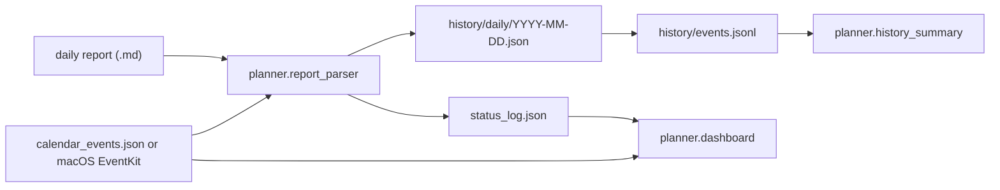

# Architecture

## Core idea

The repository separates:

- reusable planner code
- tracked starter templates
- tracked anonymized demo data
- untracked real user workspaces

## Data flow

## Package layout

- [`planner/`](../planner/)
  - `cli.py`: main user entrypoint
  - `dashboard.py`: short-window dashboard renderer
  - `report_parser.py`: fixed daily report parser
  - `history.py`: archive helpers and `events.jsonl`
  - `history_summary.py`: month/quarter/year summaries
  - `calendar_io.py`: file or macOS event loading
  - `config.py`: YAML config loading
  - `workspace.py`: workspace path model

## Workspace model

Tracked:

- [`templates/blank_workspace/`](../templates/blank_workspace/)
- [`examples/wetlab_demo/workspace_seed/`](../examples/wetlab_demo/workspace_seed/)

Untracked:

- `workspace/`
- any user-created workspace outside the repo

## Stable data shapes in v1

- `data/plan_details.json`
  - `streams`
  - `experiments`
  - `days`
- `data/status_log.json`
  - `statuses`
- `history/daily/YYYY-MM-DD.json`
  - parsed payload + daily snapshot + event records
- `history/events.jsonl`
  - event-level historical archive

## Summary density by period

- Month
  - weekly overview
  - daily review
- Quarter
  - weekly roadmap
  - weekly review
- Year
  - monthly milestones
  - monthly review
